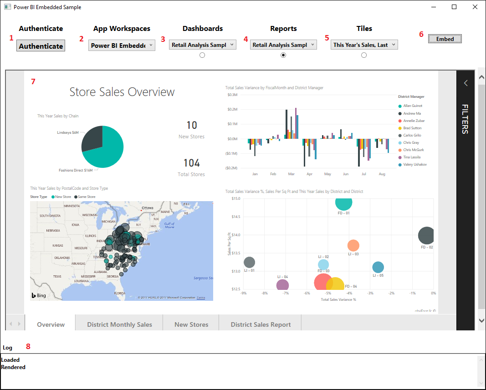
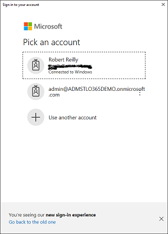
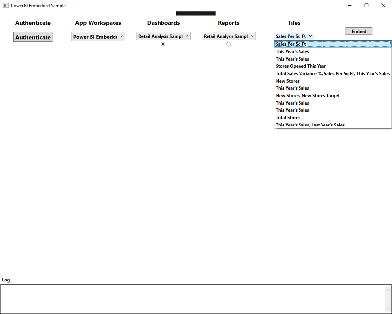
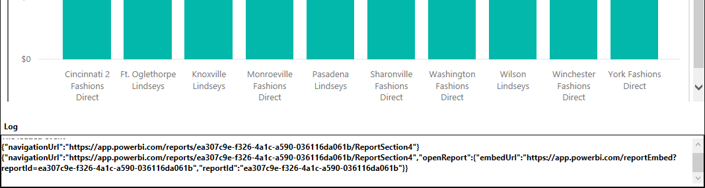
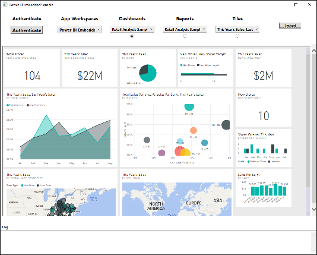
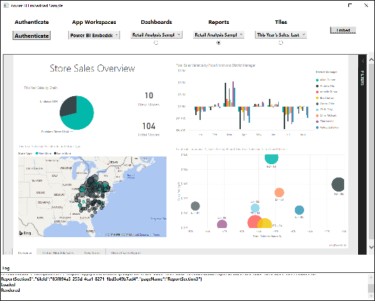
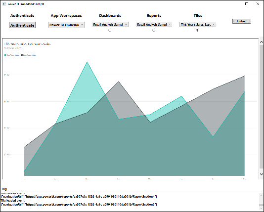

# Integrate Power BI Dashboards, Reports and Tiles into a WPF Application

Use the Power BI Embedded WPF Sample to learn how to integrate Power BI Dashboards, Reports and Tiles into a Windows Presentation Foundation application.  The sample covers the **"User Owns the Data"** scenario.   **"App Owns the Data"** scenarios can be acomnplished but there are serious security considerations with native applications and the risk of the secret\password for the application credential being compromised.  Therefore the **"App Owns the Data"** scenario will be out of scope.  Also covered will be the use of the [Power BI .NET SDK](https://github.com/Microsoft/PowerBI-CSharp) to look up obects in the power BI Tenant.

This document will not be a complete overview of the process to embed Power BI objects into applications.  As such please review the following documents on the Power BI Developer documentation site to get the prerequisites in place to be able to complete and test the sample.

## Sample Prereqs
* [Create an Azure Active Directory tenant to use with Power](https://docs.microsoft.com/en-us/power-bi/developer/create-an-azure-active-directory-tenant)
* [Register an Azure AD app to embed Power BI content](https://docs.microsoft.com/en-us/power-bi/developer/register-app)
* [Authenticate users and get an Azure AD access token for your Power BI app](https://docs.microsoft.com/en-us/power-bi/developer/get-azuread-access-token)

This sample will focus on Power BI embedded in WPF using the built-in WPF Web Browser Control.  A follow up sample will also be made available that utilizes the [CefSharp Web Browser Control](https://github.com/cefsharp/CefSharp).  CefSharp uses the [Chromium Embedded Framework (CEF)](https://bitbucket.org/chromiumembedded/cef) and provides a much richer browser functionality over the built-in WPF Browser builtin.  However in an effort to keep things easier for those that may have restrictions around the use of Third Party API and Tools this sample uses the tooling provided out-of-the-box in WPF.

This document will not be a step by step tutorial about coding the sample.  This document will highlight important area in the source and explain why things were done and how.  Essentially to make this all work the sample application needs to serve up HTML and Javascript that is both locally deployed with the application but also from Power BI. As this sample does not rely on the use of a Web Server for serving up it's deployed content locally from the file system, there are some challenges in using the WPF Web Broswer control.  Those challenges and their solutions will be the highlights of this document.

## Set-up the Workspace
### Install the Retail Analysis Sample
This document and WPF Sample application will utiize the Power BI [Retail Analysis Sample](https://docs.microsoft.com/en-us/power-bi/sample-tutorial-connect-to-the-samples#get-data-in-this-case-get-a-sample-content-pack) for the Dashboards, Reports and Tiles.  Follow the instruction in the link to set up the Retail Analysis Sample into the worksapce you created for completing this exercise.

## User accounts for samples
In order to complete the samples you will need at least two Power BI Accounts created, added to the Sample Power BI application workspace and granted the required permsission.

***In most enterprises there is a process by which users would get added to the enterprise tenant.  This might be through the use of an Identity Mangement System or some other approved workflow.  Unless you have a demo or trial tenant, that you have the appropriate adminsitrative permissions, make sure you follow your enterprises process for getting a user added.***

The type of account required is:

### User Owns the Data Scenario
In this scenario the user that will be accessing the Power BI embedded content via the Native WPF application will be using **their** individual Power BI Pro credentials to be able to access the content from their own Power BI Tenant and presenting it in WPF Application.  In this case a **standard user account** in the Power BI Tenant with permissions granted to access the sample App Workspace.  

## Sample App Overview
The concept of this application is mimic most of the functionality of the online [Microsoft Power BI Embedded Sample](https://microsoft.github.io/PowerBI-JavaScript/demo/v2-demo/index.html).  The code is not meant to be a best practice for WPF development or usability.  The focus is on getting Power BI embedded to work from within a WPF application. 

This sample supports the view mode of the following Power BI objects:

* Dashboards
* Reports
* Tiles

The Q&A objects can be supported later as well as the Edit and Create Modes but will not be covered in this version.  

The working sample looks like:


The sections noted on the image above are:

1. Pressing the authentication button will result int the application opening a separate browser window for the user to authenticate to Power BI's Azure Active Directory.
2.  Once the user has completed a successful authentication into for the Power BI Tenant this combo box will be populated with the avaiable App Workspaces in the Power BI Tenant tha the user has access to.
3.  Once an application workspace has been selected this combobox will be populated with the Dashboards available to user in the workspace.  Additionally the user must check the radio button if they would like to embed the selected dashboard into the in app web browser
4.  Once an application workspace has been selected this combobox will be populated with the Reports available to user in the workspace.  Additionally the user must check the radio button if they would like to embed the selected report into the in app web browser
5.  Once an application workspace and Dashboard have been selected this combobox will be populated with the Tiles available to user in the Dashboard.  Additionally the user must check the radio button if they would like to embed the selected Tile into the in app web browser
6.  After the user has selected the Ap Workspace, object type and the selected object to be ebmedded this button is pressed to embed the object into the in app web browser.
7.  This is the in app web browser where the Power BI objects wil be displayed.
8.  This is where the log messages from the Power BI Events that were defined in the JavaScript will be displayed.

## Sample Source Overview
We will walk through the pertinent sections of the source as the flow of authenticating, selecting Power BI Embedded object, rendering and logging occur.

### Application Initialization
At application startup there are some object that need to be initialized beyond those needed for any WPF application these include a TokenCache and Authentication Context. The TokenCache being used in the sample is the default built in in-meory cache provied by ADAL.  This can be replaced with other Cache types for additional security and persistance. Additionally, the required appSetting for successful login to Azure AD are pulled in from the App.Config file.  

**Note:** Make sure you update the App.config with the proper settings as obtained when registering your application with Azure AD.  [see above](#sample-prereqs)

### Authentication and Power BI Object Loading
The first step in using the application is getting the user authenticated.  Upon clicking the Authenticate button the user will be presented with a external pop-up window that allows the user to select existing accounts to login to Azure AD or use a new one.  This is functionality built into the Azure ADAL library.  



This dialog authenticates the user to the Azure AD Tenenat associated with users and their O365\Power BI Tenant.  The following code kicks this process off with the result of the successful authentication being captured.

```cs
                result = await authContext.AcquireTokenAsync(ResourceId, clientId, redirectUri, new PlatformParameters(PromptBehavior.SelectAccount));
                Token = result.AccessToken;
                tokenCredentials = new TokenCredentials(Token, "Bearer");
```
The AcquireTokenAsync method requires the ResourceId,ClientId and redirectId.  These parameters should b configured in the App.Config file using the values you entered when registering the application in Azure AD.

Once the authentication is successful the access token is obtained from the result and a TokenCredential is created.  The Token is used when calling into Power BI Embedded to obtain an embedded object such as a Dashboard, Report or Tile.  The TokenCredential is used by the Power BI .NET SDK for looking up objects in the Power BI Tenenat. 

Once the Tokens and TokenCredentials are saved off the method
```cs 
GetAppWorkSpaceList() 
```
is called.  This method uses the Power BI .NET SDK to look up the available application workspaces for the logged in user in the Power BI Tenant.  The results are added to the ComboBox so that the user can select any Application workspace associated with their account to get the associated Power BI Objects.

Populating the AppWorkSpaceList ComboBox also causes an SelectionChanged Event which uses the Selected Application Workspace ID to lookup the Power BI objects in the workspace such as Dashboards, Reports and Tiles and populated these values into the ComboBoxes for those objects allowing the user to select the object type and specific object they would like to embed in the in app browser.

A similar process also occurs when the user selects a new Dashbord.  Changing the Dashboard selection causes a SelectionChanged Event that calls back to Power BI to look up the tiles associated with that new Dashboard and populate the values into the Tiles ComboBox. 

At this point the application looks something like this


### Embedding Objects in the in App Browser
Once the login and Power BI object has been selected the user can press the Embed button.  This starts the following flow from within the application.

1.  The WPF web Browser Control is provided a ObjectForScripting.  This is a class that provides a mechanism by which communication between the Javscript in the Web Browser Control can communicate with the containing WPF application host.  The object assigned in this case is

L``cs
        [ComVisible(true)]
        public class AddJavascriptObjects
        {
            TextBlock logWindow = null;
            Action fireJavaScript = null;
            public AddJavascriptObjects(TextBlock logWindow, Action action)
            {
                this.logWindow = logWindow;
                this.fireJavaScript = action;
            }
            public void LogToBrowserHost(string message)
            {
                logWindow.Text = logWindow.Text + message + "\r\n";
                // Force logger to bottom of scroll
                var parentContainer = (ScrollViewer)logWindow.Parent;
                parentContainer.UpdateLayout();
                parentContainer.ScrollToVerticalOffset(parentContainer.ScrollableHeight);

            }
            public void triggerDocumentComplete()
            {
                fireJavaScript();
            }
        }
```
   The AddjavaScriptObjects class provides two methods

* TriggerDocumentComplete()
    * Due to some limitation on the WPF browser Control it was neccessary for the Browser Control to call back into the WPF host to let the Host know that the HTML and JavaScript is loaded and ready.  The built-in event for the Web Browser Control fires after the files have been loaded but not processed\rendered into the DOM.
* LogToBrowserHost()
    * This method allows the JavaScript in the Web Browser Control to pump Power BI events back out to the WPF host so they can be displayed for logging
    

2. The Web Browser Control is then passed the URI to the locally provided HTML file that bootstraps the browser so that Power BI Objects cn be rendered.  The ReportLoader.html is a very stripped down HTML File that pulls in the the required Javascript and provides a DIV container to render the Power BI Object into.
    * **Key Points:** Due to issue with pulling in local content into the web browser there are some things to be aware of:
        * A ["Mark-of-the-Web"](https://msdn.microsoft.com/en-us/library/ms537628(v=vs.85).aspx) comment is added to the top of the HTML 
            * ```<!-- saved from url=(0014)about:internet --> ```
            * Doing this prevents some of the issues related to working with files provided to the browser control from the local file system instead of a Web Server.
        * A [X-UA-Compatible meta tag](https://blogs.msdn.microsoft.com/patricka/2015/01/12/controlling-webbrowser-control-compatibility/) is added to the HEAD of the HTML.
            * ```<meta http-equiv="X-UA-Compatible" content="IE=edge">```
            * This forces the Browser control to render in the highest available document mode.
            * The same result can also be achieved with Registry Setting See FEATURE_BROWSER_EMULATION 
                * A helper class is provided in the sample to set browser features through Registry if you have an interest but is not required due to the meta tag.
        * **es6 Promise** JavaScript is pulled in.
            * The browser control did not support promises.  So adding this provided a shim to get the Power BI Javascript to work.
        * **ReportLoader.js** is sourced into the HTML.
            *  This is the Javascript used to load in the Power BI Embedded objects and call back to the WPF host to send log events.
        * An onload event is added to the BODY tag of the HTML
            * ```<body onload="window.external.triggerDocumentComplete()">```
                * This event calls back into the AddJavaScriptsObject of the host to let the host know that the HTML and JavaScript are loaded, rendered and ready
        * Once the Web Browser Control Navigated Event is reached the following is called to prevent the WebBrowser Control from triggering Javascript errors due to the Local Content.  The scripts still run but you avoid endless script error windows. (See the [Acknowledgement](#acknowledgements) to Wolf5 below)
        ```cs
        public void HideScriptErrors(WebBrowser wb, bool Hide)
        {
            FieldInfo fiComWebBrowser = typeof(WebBrowser).GetField("_axIWebBrowser2", BindingFlags.Instance | BindingFlags.NonPublic);
            if (fiComWebBrowser == null) return;
            object objComWebBrowser = fiComWebBrowser.GetValue(wb);
            if (objComWebBrowser == null) return;
            objComWebBrowser.GetType().InvokeMember("Silent", BindingFlags.SetProperty, null, objComWebBrowser, new object[] { Hide });
        }
        ```
3.  The ONLOAD Event of the HTML BODY is called triggering a callback to the WPF Host that calls the method
	```cs
	PBIEmbedded_Invoke()
	```
	
  * This method makes a call back into the browser control requesting the LoadEmbeddedObject Javascript function runs from ReportLoader.js.  As part of that call an object array containg the required paramteters to run the LoadReport is hydrated and sent into the borwser control so that the LoadReport can call the Power BI Javascript API to load and render the Power BI object into the Web Browser Control.

  The call from the WPF host:

  ```cs
   PBIEmbeddedWB.InvokeScript("LoadEmbeddedObject", parameters);
  ```

  The LoadEmbeddedObject function in the ReportLoader.js

  ```js
  function LoadEmbeddedObject(embedUrl, accessToken, embedId, embedType, tokenType, dashboardId) {

    var models = window['powerbi-client'].models
    var permissions = models.Permissions.All;
    
    var config = {
        type: embedType,
        accessToken: accessToken,
        tokenType: tokenType,
        embedUrl: embedUrl,
        id: embedId,
        dashboardId: dashboardId,
        permissions: permissions,
        settings: {
            filterPaneEnabled: true,
            navContentPaneEnabled: true
        }
    };


    // Grab the reference to the div HTML element that will host the report.
    var embedContainer = document.getElementById('EmbedContainer');
    // Embed the report and display it within the div container.
    var embed = powerbi.embed(embedContainer, config);

    // Report.off removes a given event handler if it exists.
    embed.off("loaded");

    // Report.on will add an event handler which prints to Log window.

    embed.on("loaded", function () {
        window.external.LogToBrowserHost("Loaded");
        // Report.off removes a given event handler if it exists.

        embed.off("loaded");

    });

    embed.on("error", function (event) {
        window.external.LogToBrowserHost(event.detail);

        embed.off("error");
    });

    // Report.on will add an event handler which prints to Log window.

    embed.on("rendered", function () {
        window.external.LogToBrowserHost("Rendered");
        // Report.off removes a given event handler if it exists.
        embed.off("rendered");

    });

    embed.off("saved");

embed.on("saved", function (event) {
        window.external.LogToBrowserHost(event.detail);
        if (event.detail.saveAs) {
            window.external.LogToBrowserHost('In order to interact with the new report, create a new token and load the new report');
        }
    });
    if (embedType === "tile") {
        embed.off("tileLoaded");
        //// Tile.on will add an event handler which prints to Log window.
        embed.on("tileLoaded", function (event) {
            window.external.LogToBrowserHost("Tile loaded event");
            window.external.LogToBrowserHost(JSON.stringify(event.detail));
        });
    };
    if (embedType === "dashboard" || embedType === "tile") {
        embed.off("tileClicked");
        embed.on("tileClicked", function (event) {
            window.external.LogToBrowserHost(JSON.stringify(event.detail));
        });
    };

};
  ```

4.  Finally any Power BI event that have been registered in the ReportLoader.js and get fired result in the Event Detail being sent back to the WPF web browser host for disply in the logging container in the host.

**Dashboard**




**Report**




**Tile**



## Wrap Up
I hope you find this sample and overview useful.  I suspect the case of embedding Power BI in WPF Applications will not be the standard use case but if you need to do it you should have the pieces to get it running.

## Sample Source
The source for the sample application can be located at
[PowerBIEmbedded-Native-WPFBrowser](https://github.com/rreilly70/PowerBIEmbedded-Native-WPFBrowser)

## Acknowledgements
* [Noseratio](https://stackoverflow.com/users/1768303/noseratio) - For code samples on setting browser control features in the Registry.  Not needed if using the Meta Tag http-equiv="X-UA-Compatible" but kept the code in as you might find other browser control features you would like to set from the application and this code make it easy.
* [Wolf5](https://stackoverflow.com/users/37643/wolf5) - For code on supressing script errors when using the WPF WebBrowser control
